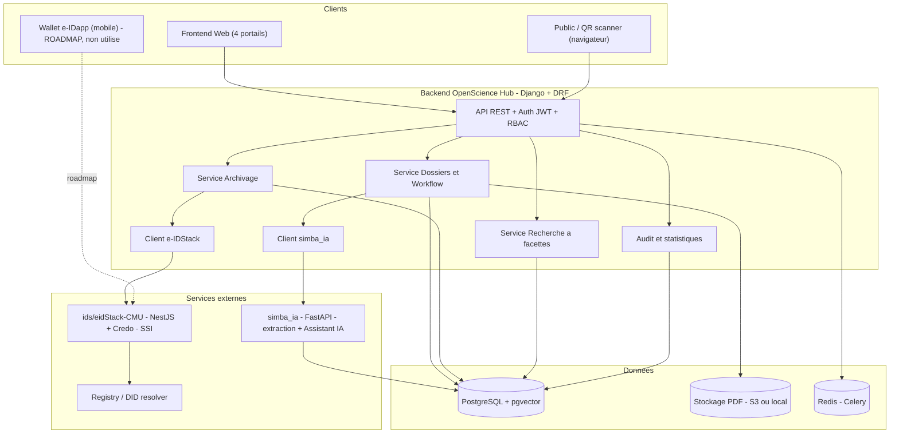
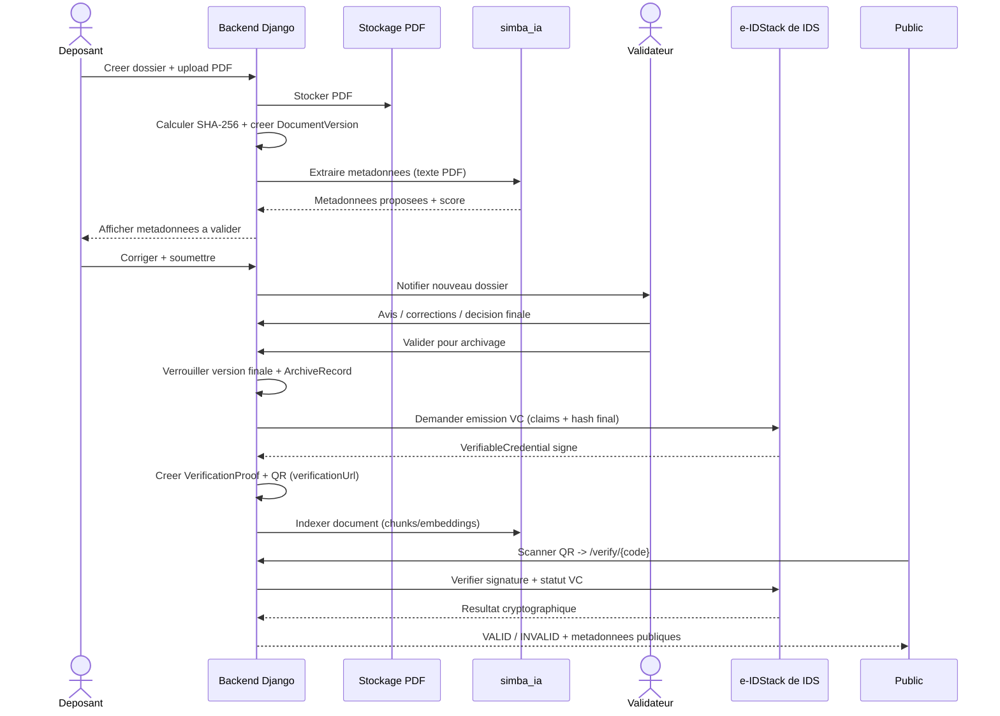

# OpenScience Hub — Architecture technique

> Architecture cible du système et du **backend Django**. Voir aussi [PRD.md](PRD.md), [DATA_MODEL.md](DATA_MODEL.md), [SSI_INTEGRATION.md](SSI_INTEGRATION.md), [API_SPEC.md](API_SPEC.md).

---

## 1. Vue d'ensemble du monorepo

```text
OpenScienceHub/
├── backend/        # API principale — Django + DRF + PostgreSQL (CE QUE NOUS CONSTRUISONS)
├── frontend/       # Application web (4 portails) — séparée, consomme l'API
├── simba_ia/       # Microservice IA — Python/FastAPI (extraction PDF + Assistant IA / RAG, pgvector)
└── ids/            # e-IDStack de IDS — couche SSI
    ├── eidStack-CMU/   # Backend NestJS + Credo-TS (émission/vérification Verifiable Credentials)
    ├── e-IDapp_CMU/    # Wallet mobile (React Native)
    └── eid-sandbox-CMU/
```

Le **backend** est le **chef d'orchestre** : il détient le modèle métier et appelle `simba_ia` (IA) et `ids/eidStack-CMU` (SSI) via des clients HTTP dédiés.

## 2. Diagramme de composants



> **Note SSI (sans wallet)** : OpenScience Hub n'utilise pas le wallet mobile `e-IDapp`. L'institution est **émettrice** et la plateforme est **dépositaire** (le `VerifiableCredential` est conservé en base, pas dans une appli perso). La vérification est **web** : le public scanne le QR → `/verify/{code}` → le backend interroge e-IDStack (signature/statut) et recompare le hash. Le wallet reste une option roadmap pour donner aux auteurs une preuve portable.

## 3. Découpage du backend en apps Django

| App | Responsabilité |
|---|---|
| `common` | Base abstraite (UUID, timestamps), utilitaires, pagination, permissions de base |
| `accounts` | Utilisateurs, rôles, permissions, affectations par périmètre, JWT |
| `institutions` | Institutions, facultés, départements, programmes |
| `works` | `ScientificWork`, contributeurs, transitions de workflow |
| `documents` | Versions de documents, upload, hash SHA-256, verrouillage version finale |
| `validation` | Affectations, avis, corrections, décisions, soutenances, événements workflow |
| `archive` | `ArchiveRecord`, publication, déclenchement preuve |
| `search` | Indexation à facettes, endpoints catalogue public |
| `ai` | Client `simba_ia`, `MetadataExtraction`, `AIQueryLog`, citations |
| `ssi` | Client e-IDStack, `VerifiableCredential`, `VerificationProof`, vérification publique |
| `audit` | Journal d'audit immuable, statistiques |

## 4. Flux de bout en bout (séquence)



## 5. Intégration `simba_ia` (IA)

- Communication **HTTP REST** backend → `simba_ia`.
- Deux usages : **extraction de métadonnées** (au dépôt) et **Assistant IA** (question/réponse sourcée + similarité).
- Le backend stocke les résultats (`MetadataExtraction`, `AIQueryLog`) ; `simba_ia` gère embeddings et `pgvector`.
- Client encapsulé : `apps/ai/client.py` (timeouts, retries, mode `live` obligatoire ; erreur explicite si le service n'est pas joignable).
- Garde-fou : l'IA **propose**, l'humain **valide** ; aucune décision automatique.

Endpoints attendus côté `simba_ia` (contrat indicatif) :
- `POST /extract` — `{ document_id, text | file_url }` → métadonnées proposées + `confidence`.
- `POST /index` — `{ document_id, version_id, text, metadata }` → indexation.
- `POST /assistant/query` — `{ question, filters }` → `{ answer, sources[] }`.
- `POST /similar` — `{ work_id | text, filters }` → `{ results[] }`.

## 6. Intégration `e-IDStack de IDS` (SSI)

- Communication **HTTP REST** backend → `ids/eidStack-CMU` (NestJS + Credo-TS, Swagger disponible).
- Usages : **émission** d'un Verifiable Credential après archivage et **vérification** lors d'un scan QR.
- Client encapsulé : `apps/ssi/client.py` (config par institution, gestion `SSI_PENDING`, mode `live` obligatoire).
- Détails du contrat dans [SSI_INTEGRATION.md](SSI_INTEGRATION.md).
- Garde-fou : aucune crypto « maison » ; le backend orchestre, e-IDStack signe/vérifie.

## 7. Données et stockage

- **PostgreSQL** : modèle métier relationnel (voir [DATA_MODEL.md](DATA_MODEL.md)).
- **pgvector** : embeddings pour recherche sémantique / Assistant IA (géré principalement par `simba_ia`).
- **Stockage fichiers** : PDF et versions via `django-storages` (S3-compatible) ; local en dev.
- **Redis + Celery** : tâches asynchrones (extraction, indexation, émission de preuve, notifications).

## 8. Sécurité et configuration

- **Auth** : JWT (access + refresh). **RBAC** applicatif par périmètre.
- **Secrets** : `.env` / variables d'environnement (`DATABASE_URL`, `SIMBA_IA_URL`, `EIDSTACK_BASE_URL`, `EIDSTACK_API_KEY`, `JWT_SIGNING_KEY`, `STORAGE_*`).
- Les clés/API tokens e-IDStack et IA ne sont **jamais** renvoyés par l'API.
- CORS restreint au frontend ; endpoints publics (catalogue, vérification) en lecture seule et filtrés par visibilité.

## 9. Environnements et exécution

- **Dev** : `docker-compose.yml` + `docker-compose.dev.yml` lancent PostgreSQL, Redis, backend, frontend, `simba_ia` et e-IDStack de IDS en mode live local.
- **Config par environnement** : `TEST | STAGING | PRODUCTION` pour la connexion SSI.
- **Docs API** : `drf-spectacular` expose `/api/schema` + Swagger UI.

## 10. Principes d'architecture

1. Le **dossier** (`ScientificWork`) est l'objet central, pas le PDF.
2. **Orchestration, pas réimplémentation** : IA dans `simba_ia`, SSI dans `e-IDStack`.
3. **Logique métier dans des services**, pas dans les vues.
4. **Tout est auditable** ; les états d'échec sont explicites (`SSI_PENDING`, extraction `FAILED`).
5. **Paramétrable par institution** (workflows, facettes, config SSI).
