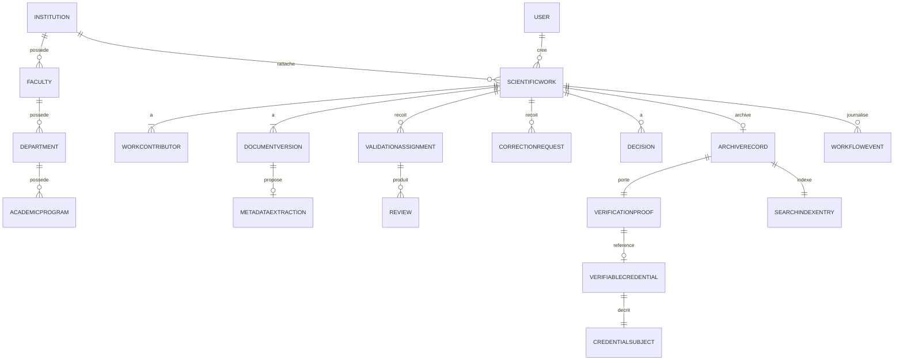

# OpenScience Hub — Modèle de données (backend Django)

> Traduction du diagramme de classes v4 (`../../Docs/OpenScienceHub_ClassDiagram_v4.md`) en **modèles Django / PostgreSQL**. Voir aussi [ARCHITECTURE.md](ARCHITECTURE.md) et [SSI_INTEGRATION.md](SSI_INTEGRATION.md).

---

## 1. Conventions générales

- **PK** : `UUIDField(primary_key=True, default=uuid4, editable=False)`.
- **Horodatage** : `created_at = DateTimeField(auto_now_add=True)`, `updated_at = DateTimeField(auto_now=True)` sur toutes les entités (via un `TimeStampedModel` abstrait dans `common`).
- **Enums** : `models.TextChoices`.
- **Relations** : `ForeignKey(..., on_delete=models.PROTECT)` pour le référentiel ; `CASCADE` pour les enfants d'un dossier (versions, avis, etc.).
- **Argent / scores** : `DecimalField`.
- Mapping des champs `camelCase` de la doc → `snake_case` Django.

Modèle de base (app `common`) :

```python
import uuid
from django.db import models

class TimeStampedModel(models.Model):
    id = models.UUIDField(primary_key=True, default=uuid.uuid4, editable=False)
    created_at = models.DateTimeField(auto_now_add=True)
    updated_at = models.DateTimeField(auto_now=True)

    class Meta:
        abstract = True
```

## 2. Référentiel académique (`institutions`)

### `Institution`
| Champ | Type Django | Notes |
|---|---|---|
| name | `CharField` | nom officiel |
| type | `CharField(choices=InstitutionType)` | |
| country | `CharField` | |
| city | `CharField` | |
| official_email | `EmailField(null=True, blank=True)` | |
| website_url | `URLField(null=True, blank=True)` | |

Relations : `1—* Faculty`, `1—* User`, `1—* ScientificWork`, `1—1 EidStackConnection`, `1—1 DecentralizedIdentifier` (issuer).

### `Faculty`
`name`, `code`, `institution = FK(Institution)`. Relation `1—* Department`.

### `Department`
`name`, `code`, `faculty = FK(Faculty)`. Relations `1—* AcademicProgram`, `1—* ScientificWork`.

### `AcademicProgram`
`name`, `level (AcademicLevel)`, `code (null=True)`, `department = FK(Department)`.

## 3. Identité, rôles, permissions (`accounts`)

### `User`
Étend `AbstractBaseUser` (ou `AbstractUser`). Champs : `full_name`, `email (unique)`, `password` (hash), `status (UserStatus)`, `institution = FK(Institution, null=True)`, `last_login_at (null=True)`.

### `Role`
`code (unique)`, `label`, `scope (RoleScope)`, `is_system_role (bool)`.

### `Permission`
`code (unique)`, `description`.

### `RolePermission` (jointure)
`role = FK(Role)`, `permission = FK(Permission)`, `granted_at`.

### `UserRoleAssignment`
`user = FK(User)`, `role = FK(Role)`, `scope_type (ScopeType)`, `scope_id (UUID, null=True)`, `assigned_at`, `valid_from (null)`, `valid_until (null)`.

> Règle : un rôle a toujours un périmètre clair. Permissions globales rares.

## 4. Dossier scientifique (`works`)

### `ScientificWork` (racine métier)
| Champ | Type | Notes |
|---|---|---|
| reference_code | `CharField(unique)` | ex. `OSH-UY1-INF-2026-0001` |
| type | `CharField(choices=WorkType)` | MEMOIRE / THESE / ARTICLE |
| title | `CharField` | |
| abstract_text | `TextField` | |
| language | `CharField(choices=Language)` | |
| academic_year | `CharField` | ex. `2025-2026` |
| keywords | `ArrayField(CharField)` | (Postgres) |
| status | `CharField(choices=WorkStatus)` | |
| visibility | `CharField(choices=Visibility)` | |
| institution | `FK(Institution)` | |
| faculty | `FK(Faculty, null=True)` | |
| department | `FK(Department, null=True)` | |
| program | `FK(AcademicProgram, null=True)` | |
| created_by | `FK(User)` | |
| submitted_at | `DateTimeField(null=True)` | |

Relations : `1—1..* WorkContributor`, `1—1..* DocumentVersion`, `1—* ValidationAssignment`, `1—* Decision`, `1—0..1 ArchiveRecord`.

### `WorkContributor`
`work = FK(ScientificWork)`, `contributor_type (ContributorType)`, `display_name`, `email (null)`, `orcid (null)`, `order_index`, `user = FK(User, null=True)`.

### `DocumentVersion` (`documents`)
| Champ | Type | Notes |
|---|---|---|
| work | `FK(ScientificWork)` | |
| version_number | `PositiveIntegerField` | |
| version_type | `CharField(choices=VersionType)` | |
| file_name | `CharField` | |
| file | `FileField` | stockage S3/local |
| mime_type | `CharField` | `application/pdf` |
| page_count | `PositiveIntegerField(null=True)` | |
| sha256_hash | `CharField(max_length=64)` | recalculé à chaque upload |
| change_note | `TextField(null=True)` | |
| is_final | `BooleanField(default=False)` | |
| uploaded_by | `FK(User)` | |

Contraintes : une seule version `is_final=True` par `work` (`UniqueConstraint` conditionnelle) ; version finale immuable.

### `MetadataExtraction` (`ai`)
`document_version = FK(DocumentVersion)`, `model_name`, `extracted_title (null)`, `extracted_abstract (null)`, `extracted_keywords (ArrayField)`, `suggested_domain (null)`, `detected_language (null)`, `confidence_score (Decimal)`, `raw_json (JSONField)`, `status (ExtractionStatus)`, `reviewed_at (null)`.

> Séparé du dossier : l'IA **propose**, l'humain **valide**.

## 5. Validation académique (`validation`)

### `ValidationAssignment`
`work = FK(ScientificWork)`, `assignment_type (AssignmentType)`, `status (AssignmentStatus)`, `assignee = FK(User)`, `assigned_at`, `due_at (null)`. Relation `1—* Review`.

### `Review`
`assignment = FK(ValidationAssignment)`, `author = FK(User)`, `document_version = FK(DocumentVersion, null=True)`, `comment (Text)`, `recommendation (Recommendation)`, `conformity_score (null)`.

### `CorrectionRequest`
`work = FK(ScientificWork)`, `type (CorrectionType)`, `message (Text)`, `priority (CorrectionPriority)`, `status (CorrectionStatus)`, `requested_by = FK(User)`, `related_page (null)`, `requested_at`, `resolved_at (null)`.

### `DefenseSession`
`work = FK(ScientificWork)`, `session_type (DefenseSessionType)`, `scheduled_at`, `location (null)`, `result (DefenseResult, null)`, `jury_members = M2M(User)`.

### `Decision`
`work = FK(ScientificWork)`, `decision_type (DecisionType)`, `comment (null)`, `decided_by = FK(User)`, `document_version = FK(DocumentVersion, null=True)`, `decided_at`.

### `WorkflowEvent` (journal de transitions)
`work = FK(ScientificWork)`, `from_status (WorkStatus, null)`, `to_status (WorkStatus)`, `event_type (WorkflowEventType)`, `actor = FK(User, null=True)`, `comment (null)`.

## 6. Archivage (`archive`)

### `ArchiveRecord`
`work = FK(ScientificWork)` (`OneToOne`/0..1), `document_version = FK(DocumentVersion)` (version finale), `public_slug (unique)`, `access_level (AccessLevel)`, `is_download_allowed (bool)`, `archived_at`, `published_at (null)`. Relation `1—1 VerificationProof`, `1—1 SearchIndexEntry`.

## 7. Recherche à facettes (`search`)

### `SearchIndexEntry`
`archive_record = FK(ArchiveRecord)`, `normalized_title`, `full_text_ref`, `status (IndexStatus)`, `indexed_at`.

### `FacetDefinition`
`code (unique)`, `label`, `source_field`, `data_type (FacetDataType)`, `is_enabled (bool)`.

### `SearchFacetValue`
`index_entry = FK(SearchIndexEntry)`, `facet = FK(FacetDefinition)`, `value`, `normalized_value`, `count_hint (null)`.

## 8. Assistant IA (`ai`)

### `AIKnowledgeChunk`
`document_version = FK(DocumentVersion)`, `chunk_text (Text)`, `page_start (null)`, `page_end (null)`, `embedding_ref`, `metadata_json (JSON)`.
> Les embeddings/`pgvector` sont gérés côté `simba_ia` ; le backend conserve les références.

### `AIModelConfig`
`provider`, `model_name`, `purpose (AIPurpose)`, `is_active (bool)`.

### `AIQueryLog`
`question (Text)`, `answer (Text)`, `answer_status (AIAnswerStatus)`, `user = FK(User, null=True)`, `created_at`. Relation `1—* AIAnswerCitation`.

### `AIAnswerCitation`
`query = FK(AIQueryLog)`, `chunk = FK(AIKnowledgeChunk, null=True)`, `excerpt (Text)`, `score (Decimal)`, `page_number (null)`.

## 9. SSI via e-IDStack de IDS (`ssi`)

### `EidStackConnection`
`institution = FK(Institution)` (OneToOne), `base_url`, `tenant_id (null)`, `environment (Environment)`, `api_credential_ref`, `is_active (bool)`, `connection_status (ConnectionStatus)`, `last_sync_at (null)`.
> `api_credential_ref` = référence vers un secret (jamais le secret en clair).

### `DecentralizedIdentifier`
`did (unique)`, `method`, `controller_type (DIDControllerType)`, `institution = FK(Institution, null=True)`, `user = FK(User, null=True)`.

### `CredentialSchema`
`schema_uri`, `schema_name`, `version`.

### `CredentialSubject`
`subject_did (null)`, `subject_type (CredentialSubjectType)`, `claims_json (JSON)`, `work = FK(ScientificWork)`, `document_version = FK(DocumentVersion)`.

### `VerifiableCredential`
`credential_id (unique)`, `issuer_did = FK(DecentralizedIdentifier)`, `subject = FK(CredentialSubject)`, `schema = FK(CredentialSchema)`, `issuance_date`, `expiration_date (null)`, `proof_format (ProofFormat)`, `status (CredentialStatus)`, `raw_credential_json (JSON)`.

### `CredentialStatusRecord`
`credential = FK(VerifiableCredential)` (OneToOne), `status_list_url (null)`, `revocation_reason (null)`, `updated_at`.

### `VerificationProof`
`archive_record = FK(ArchiveRecord)` (OneToOne), `credential = FK(VerifiableCredential, null=True)`, `proof_code (unique)` (ex. `OSH-VC-2026-0001`), `proof_type (ProofType)`, `document_hash (char 64)`, `verification_url`, `qr_code_url`, `status (ProofStatus)`, `issued_at`.
> Le QR ne contient pas le credential : il pointe vers `verification_url`.

### `VerificationCheck`
`proof = FK(VerificationProof)`, `result (VerificationResult)`, `source (VerificationSource)`, `client_ip_hash (null)`, `user_agent_hash (null)`, `checked_at`.

## 10. Audit (`audit`)

### `AuditEvent` (immuable)
`actor = FK(User, null=True)`, `actor_role`, `institution = FK(Institution, null=True)`, `action_type (AuditActionType)`, `module`, `old_value (JSON, null)`, `new_value (JSON, null)`, `ip_address (null)`, `severity (AuditSeverity)`, `status`, `comment (null)`, `created_at`.

## 11. Énumérations (`TextChoices`)

```text
WorkType            : MEMOIRE, THESE, ARTICLE  (roadmap: COMMUNICATION, RAPPORT_RECHERCHE)
WorkStatus          : DRAFT, SUBMITTED, UNDER_REVIEW, CORRECTION_REQUESTED, RESUBMITTED,
                      VALIDATED, ARCHIVED, REJECTED
Visibility          : PRIVATE, INSTITUTION_ONLY, PUBLIC, RESTRICTED
Language            : FR, EN, OTHER
ContributorType     : AUTHOR, SUPERVISOR, CO_SUPERVISOR, REVIEWER, RAPPORTEUR, JURY_MEMBER
VersionType         : INITIAL_SUBMISSION, CORRECTED_VERSION, FINAL_ARCHIVE
ExtractionStatus    : PENDING, EXTRACTED, REVIEWED, FAILED
AssignmentType      : SUPERVISOR_REVIEW, SCIENTIFIC_COMMITTEE, PEER_REVIEW, ARCHIVE_CONTROL
AssignmentStatus    : PENDING, IN_PROGRESS, COMPLETED, CANCELLED
Recommendation      : ACCEPT, MINOR_CORRECTION, MAJOR_CORRECTION, REJECT
CorrectionType      : ADMINISTRATIVE, SCIENTIFIC, METADATA, PDF_FILE, ABSTRACT, KEYWORDS,
                      BIBLIOGRAPHY, VISIBILITY, FINAL_VERSION, INSTITUTIONAL_COMPLIANCE
CorrectionPriority  : LOW, NORMAL, HIGH, BLOCKING
CorrectionStatus    : OPEN, IN_PROGRESS, ANSWERED, VALIDATED, REJECTED, CANCELLED
DefenseSessionType  : MASTER_DEFENSE, PHD_DEFENSE
DefenseResult       : PASSED, PASSED_WITH_CORRECTIONS, FAILED, POSTPONED
DecisionType        : AUTHORIZE_DEFENSE, VALIDATE_AFTER_DEFENSE, REQUEST_CORRECTION,
                      ACCEPT_ARTICLE, REJECT, ARCHIVE
WorkflowEventType   : SUBMISSION, ASSIGNMENT, REVIEW, CORRECTION, DECISION, ARCHIVE, CREDENTIAL_ISSUED
AccessLevel         : OPEN_ACCESS, METADATA_ONLY, RESTRICTED_ACCESS
IndexStatus         : PENDING, INDEXED, FAILED
FacetDataType       : TEXT, NUMBER, DATE, ENUM
AIPurpose           : METADATA_EXTRACTION, SCIENTIFIC_SEARCH, SUMMARY, VALIDATION_ASSISTANCE
AIAnswerStatus      : ANSWERED, NO_CONTEXT_FOUND, FAILED, FLAGGED
UserStatus          : ACTIVE, SUSPENDED, PENDING
RoleScope           : GLOBAL, INSTITUTION, DEPARTMENT, WORK
ScopeType           : PLATFORM, INSTITUTION, FACULTY, DEPARTMENT, PROGRAM, WORKFLOW, SCIENTIFIC_WORK
InstitutionType     : PUBLIC_UNIVERSITY, PRIVATE_UNIVERSITY, RESEARCH_INSTITUTE, JOURNAL, SCHOOL, OTHER
AcademicLevel       : BACHELOR, MASTER, DOCTORATE, ENGINEERING, RESEARCH_ARTICLE, OTHER
Environment         : TEST, STAGING, PRODUCTION
ConnectionStatus    : CONNECTED, NOT_CONFIGURED, AUTH_ERROR, SERVICE_UNAVAILABLE, MISCONFIGURED
DIDControllerType   : INSTITUTION, USER, PLATFORM
CredentialSubjectType : SCIENTIFIC_WORK, AUTHOR, INSTITUTION
ProofFormat         : JWT_VC, JSON_LD_VC, SD_JWT_VC
CredentialStatus    : ISSUED, ACTIVE, SUSPENDED, REVOKED, EXPIRED
ProofType           : HASH_QR, VERIFIABLE_CREDENTIAL
ProofStatus         : ACTIVE, REVOKED, EXPIRED, PENDING, ERROR
VerificationResult  : VALID, INVALID_HASH, NOT_FOUND, REVOKED, EXPIRED, TECHNICAL_ERROR
VerificationSource  : QR_CODE, DIRECT_LINK, MANUAL_INPUT, API
AuditActionType     : LOGIN, USER_CREATED, ROLE_CHANGED, WORKFLOW_CHANGED, PDF_UPLOADED,
                      METADATA_UPDATED, REVIEW_ADDED, CORRECTION_CREATED, DECISION_RECORDED,
                      DOCUMENT_ARCHIVED, PROOF_ISSUED, PROOF_REVOKED, QR_VERIFIED,
                      AI_SETTINGS_CHANGED, SSI_SETTINGS_CHANGED
AuditSeverity       : INFO, IMPORTANT, SENSITIVE, CRITICAL
```

## 12. Contraintes et invariants (à tester)

1. `ScientificWork` ≥ 1 `WorkContributor` de type `AUTHOR`.
2. `ScientificWork` ≥ 1 `DocumentVersion`.
3. Au plus une `DocumentVersion` avec `is_final=True` par dossier.
4. `ArchiveRecord` créé seulement si `status ∈ {VALIDATED}` (ou prêt à archiver) et référence une version finale.
5. `VerificationProof` obligatoire après archivage.
6. `VerificationProof.document_hash == DocumentVersion.sha256_hash (finale) == claims du CredentialSubject`.
7. Une réponse Assistant IA importante doit avoir ≥ 1 `AIAnswerCitation` quand un contexte existe.
8. Les `AuditEvent` ne sont jamais modifiés ni supprimés.
9. Transitions de `WorkStatus` autorisées uniquement via le service workflow (et journalisées par `WorkflowEvent`).

## 13. Diagramme relationnel simplifié


