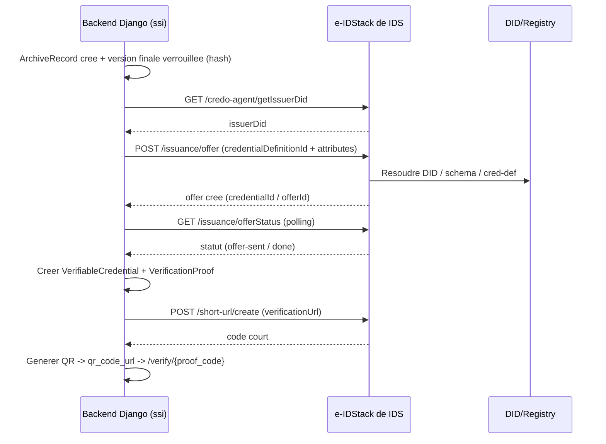
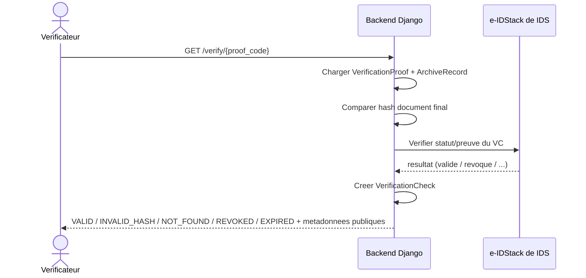

# OpenScience Hub — Intégration SSI via e-IDStack de IDS

> Contrat d'intégration entre le **backend Django** et la couche SSI **e-IDStack de IDS** (`../ids/eidStack-CMU`, NestJS + Credo-TS / AnonCreds / Indy-VDR / Askar). Voir [ARCHITECTURE.md](ARCHITECTURE.md), [DATA_MODEL.md](DATA_MODEL.md).

---

## 1. Principe

- Le backend **orchestre** ; e-IDStack **émet et vérifie** les Verifiable Credentials. Aucune cryptographie « maison » côté backend.
- **Modèle SANS wallet** : **Issuer** = Institution · **Holder/dépositaire** = **la plateforme OpenScience Hub** (le credential est stocké en base, pas dans une appli mobile) · **Verifier** = Public/Recruteur/Jury via une **page web** (`/verify/{code}`).
- Le wallet mobile `e-IDapp` n'est **pas** utilisé dans ce produit (option roadmap). Conséquence : on n'attend **aucune acceptation d'offre par un holder externe** ; la plateforme est à la fois émettrice (via le DID institutionnel d'e-IDStack) et conservatrice de la preuve.
- Toute la logique d'appel est encapsulée dans `ssi/eidstack_client.py` (timeouts, retries, mode `mock`, gestion `SSI_PENDING`).
- Vocabulaire : on dit toujours **« e-IDStack de IDS »** (jamais « eidStack-CMU »/« CMU ») dans le produit et l'API publique.

## 2. Service e-IDStack (rappel technique)

- Base : NestJS, Swagger exposé (`/api` selon config), `@credo-ts/*`, AnonCreds, Indy-VDR, Askar, `qrcode`, Prisma/PostgreSQL.
- L'agent Credo doit être **initialisé** et disposer d'un **DID issuer** + d'un **schema** + d'une **credential definition** avant d'émettre.
- e-IDStack supporte un modèle **Out-of-Band (OOB)** où un holder accepte une offre via son wallet. **Comme OpenScience Hub n'utilise pas de wallet**, on retient un des deux modes ci-dessous (sans holder externe) :
  - **Mode `live` (custodian)** : la plateforme/l'agent institutionnel détient le credential émis ; aucune invitation à un wallet tiers n'est nécessaire. On stocke `credential_id`, statut et `raw_credential_json`.
  - **Mode `mock` (MVP)** : la plateforme produit une **attestation signée par le DID institutionnel** (claims + hash) conservée en base, vérifiable côté serveur. Même interface, même page `/verify`.
- Dans les deux cas, la **vérification reste web** (QR → `/verify/{code}`), sans wallet.

### 2.1 Endpoints e-IDStack utilisés (réels)

| Domaine | Méthode + chemin | Usage |
|---|---|---|
| Agent | `POST /credo-agent/initAgent` | Initialiser l'agent |
| Agent | `GET /credo-agent/getIssuerDid` | Récupérer le DID issuer |
| Agent | `GET /credo-agent/did` | DID de l'agent |
| Agent | `GET /credo-agent/getAgent` | Statut (sanitisé) |
| Connexion | `POST /connection/createInvitation` | Invitation de connexion OOB |
| Schémas | `POST /issuance/schemas` · `GET /issuance/schemas` · `GET /issuance/listSchemas` | Gérer les schémas |
| Cred. def. | `POST /issuance/credential-definitions` · `GET /issuance/credential-definitions` | Gérer les definitions |
| Émission | `POST /issuance/offer` | Offrir un credential (OOB) |
| Émission | `GET /issuance/offerStatus?...` | Statut de l'offre |
| Vérif. | `POST /verification/createProofRequest` | Créer une demande de preuve |
| Vérif. | `GET /verification/proofStatus?proofRecordId=...` | Statut de la preuve |
| URL courte | `POST /short-url/create` · `GET /short-url/s/:code` | Lien court / QR |
| Email | `POST /email/send-invite-url` | Envoyer l'invitation par email |

### 2.2 Payload d'émission (`POST /issuance/offer`)

```json
{
  "credentialDefinitionId": "<cred-def-id>",
  "connectionId": "<optional>",
  "attributes": [
    { "name": "workId", "value": "OSH-UY1-INF-2026-0001" },
    { "name": "title", "value": "..." },
    { "name": "author", "value": "..." },
    { "name": "institution", "value": "Université de Yaoundé I" },
    { "name": "workType", "value": "MEMOIRE" },
    { "name": "documentHash", "value": "9f2a8c7b..." },
    { "name": "academicStatus", "value": "VALIDATED" },
    { "name": "issuedAt", "value": "2026-06-02" }
  ],
  "comment": "AcademicWork archive credential"
}
```

> Les `attributes` doivent correspondre au schema/cred-def configuré. Adapter selon la cred-def réellement créée dans e-IDStack.
> Sans wallet, **`connectionId` est omis** (pas de holder externe à connecter) ; l'endpoint `POST /connection/createInvitation` n'est donc **pas utilisé** dans le flux nominal.

## 3. Credential `ScientificWorkArchiveCredential`

Claims minimaux (mappés depuis `CredentialSubject.claims_json`) :

```text
workId          (reference_code du ScientificWork)
title
author          (auteur principal)
institution
department
workType        (MEMOIRE | THESE | ARTICLE)
academicStatus  (VALIDATED / soutenu / accepté ...)
documentHash    (SHA-256 de la DocumentVersion finale)
issuedAt
issuerDid
```

Règle de cohérence : `documentHash` (claim) == `DocumentVersion.sha256_hash` (finale) == `VerificationProof.document_hash`.

## 4. Flux d'émission (après archivage)



Pseudo-code (`ssi/services.py`) :

```python
def issue_proof_for_archive(archive_record):
    conn = archive_record.work.institution.eidstack_connection
    if not conn.is_active:
        return mark_pending(archive_record, reason="SSI_NOT_CONFIGURED")
    try:
        issuer_did = client.get_issuer_did(conn)
        attrs = build_attributes(archive_record)         # claims = hash final, etc.
        offer = client.offer_credential(conn, attrs)     # POST /issuance/offer
        vc = persist_verifiable_credential(offer, issuer_did)
        proof = create_verification_proof(archive_record, vc)  # document_hash == version finale
        proof.verification_url = build_verify_url(proof.proof_code)
        proof.qr_code_url = generate_qr(proof.verification_url)
        proof.status = ProofStatus.ACTIVE
        proof.save()
        audit("PROOF_ISSUED", archive_record)
    except EidStackError:
        mark_pending(archive_record, reason="SSI_PENDING")
```

## 5. Flux de vérification publique (scan QR)



- La page de vérification n'expose **que** les métadonnées publiques/nécessaires.
- Combinaison vérifiée : **hash document** + **statut dossier** + **statut VC** + **signature** (via e-IDStack).

## 6. Gestion des erreurs et états

| Situation | État backend | Comportement |
|---|---|---|
| e-IDStack non configuré | `connection_status = NOT_CONFIGURED` | preuve `SSI_PENDING`, archivage possible mais non vérifiable |
| e-IDStack injoignable | `SERVICE_UNAVAILABLE` | retry + `SSI_PENDING`, alerte admin |
| Auth invalide | `AUTH_ERROR` | bloquer émission, alerte admin |
| Émission OK | `ProofStatus.ACTIVE` | QR + fiche publique |
| Révocation | `ProofStatus.REVOKED` | vérification renvoie `REVOKED` |

Politique institutionnelle : soit **bloquer l'archivage** tant que la preuve échoue, soit **archiver en `SSI_PENDING`** et ré-émettre plus tard (paramétrable).

## 7. Configuration (par institution)

Modèle `EidStackConnection` (voir [DATA_MODEL.md](DATA_MODEL.md)). Variables d'environnement backend :

```text
EIDSTACK_BASE_URL=http://localhost:3000
EIDSTACK_API_KEY=...            # jamais renvoyé par l'API
EIDSTACK_ENVIRONMENT=TEST       # TEST | STAGING | PRODUCTION
EIDSTACK_CREDENTIAL_DEFINITION_ID=...
SSI_MODE=mock                   # mock | live  (mock = démo hors-ligne)
```

Règles de sécurité : clés/API tokens jamais exposés ; toute modification de config SSI est **auditée** ; tests de connexion (`getAgent` / `getIssuerDid`) avant passage en `PRODUCTION`.

## 8. Mode `mock` (démo hackathon)

Si `SSI_MODE=mock` ou e-IDStack indisponible, le client renvoie des réponses simulées **derrière la même interface** :
- `issue_proof_for_archive` crée un `VerifiableCredential` factice + `VerificationProof` réel (avec vrai hash).
- `/verify/{code}` valide localement le hash et renvoie `VALID` (en marquant la preuve comme simulée).
- Le passage en mode `live` ne change pas l'API publique.

## 9. Checklist d'intégration

- [ ] Agent e-IDStack initialisé (`initAgent`) + DID issuer disponible.
- [ ] Schema + credential definition `ScientificWorkArchiveCredential` créés.
- [ ] `EidStackConnection` configurée et testée (`CONNECTED`).
- [ ] Émission déclenchée uniquement après version finale verrouillée.
- [ ] `document_hash` cohérent (version finale == preuve == claim).
- [ ] QR pointe vers `/verify/{proof_code}` (jamais le credential complet).
- [ ] Vérification combine hash + statut dossier + statut VC.
- [ ] Erreurs gérées (`SSI_PENDING`) + audit `PROOF_ISSUED` / `PROOF_REVOKED`.
