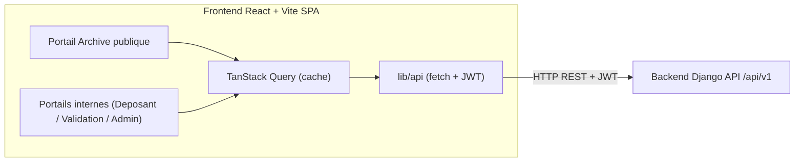

# frontend — Architecture technique

> Architecture de l'application web React. Voir [PAGES.md](PAGES.md), [DESIGN_SYSTEM.md](DESIGN_SYSTEM.md), [API_INTEGRATION.md](API_INTEGRATION.md).

---

## 1. Place dans le monorepo

```text
OpenScienceHub/
├── backend/    # API Django (la seule API consommée par le frontend)
├── simba_ia/   # IA (jamais appelée directement par le frontend)
├── ids/        # SSI (jamais appelée directement par le frontend)
└── frontend/   # CE PROJET — React/TypeScript
```

Le frontend **ne parle qu'au backend**. Auth, droits, IA et SSI sont orchestrés côté serveur.

## 2. Stack

- **React 18 + TypeScript** (strict).
- **Vite** (build/dev rapide) + **React Router** (SPA). Pas de Next.js / SSR : application monopage.
- **Tailwind CSS** + thème palette officielle (voir [DESIGN_SYSTEM.md](DESIGN_SYSTEM.md)).
- **Composants** : Radix UI / style shadcn/ui.
- **Données serveur** : TanStack Query.
- **État client** : Zustand (léger) + Context pour la session.
- **Formulaires** : react-hook-form + zod.
- **HTTP** : client encapsulé (`lib/api`) avec intercepteur JWT.
- **Tests** : Vitest + Testing Library ; Playwright (roadmap). **Mock API** : MSW.

## 3. Diagramme de contexte



## 4. Arborescence (Vite + React Router)

```text
frontend/
├── index.html
├── package.json / tsconfig.json / vite.config.ts / tailwind.config.ts
└── src/
    ├── main.tsx                   # point d'entrée + providers (Query, Router, theme)
    ├── App.tsx                    # déclaration des routes
    ├── routes/                    # pages par portail
    │   ├── public/                # accueil, catalog, works/:slug, assistant, verify/:code
    │   ├── deposant/              # dashboard, mes-dossiers, nouveau-depot, dossiers/:id
    │   ├── validation/            # dashboard, a-traiter, dossiers/:id
    │   ├── admin/                 # dashboard, utilisateurs, roles, institutions, workflows, ia, ssi, preuves, audit
    │   └── auth/                  # login, register
    ├── components/
    │   ├── ui/                    # boutons, badges, cartes, table, modale, skeletons
    │   └── layout/                # header, sidebar, page-header
    ├── features/                  # logique par domaine (works, validation, search, assistant, ssi, admin)
    │   └── <feature>/{components,hooks,api,types}
    ├── lib/
    │   ├── api/                   # client HTTP + endpoints typés (voir API_INTEGRATION.md)
    │   ├── auth/                  # session, garde de routes, rôles
    │   └── utils/
    └── styles/ index.css
```

## 5. Routage et garde par rôle

- **Public** (sans auth) : accueil, catalogue, recherche, fiche, Assistant IA, vérification.
- **Authentifié** : portails Déposant / Validation / Administration, selon **rôle** et **périmètre** renvoyés par `/accounts/me`.
- **Garde de routes** : un layout de groupe vérifie la session + le rôle ; redirection `login` si absent, `403` si rôle insuffisant.
- L'UI masque les actions non autorisées **et** le backend les refuse (l'UI ne fait pas autorité).

## 6. Données et état

- **TanStack Query** pour toutes les lectures serveur (clé par ressource + filtres), gestion `isLoading`/`isError`, invalidation après mutation.
- **Mutations** (créer dossier, soumettre, avis, décision, archiver) via `useMutation` + invalidation des requêtes liées + toasts.
- **État client** : session/JWT, préférences UI, état du wizard de dépôt (Zustand ou state local).
- **Optimistic UI** réservé aux actions sûres ; les actions critiques attendent la confirmation serveur.

## 7. Authentification

- Login → `POST /auth/login` → `{ access, refresh }`.
- Access token en mémoire ; refresh en stockage sécurisé (idéalement cookie httpOnly posé par le backend) ; intercepteur qui rafraîchit sur 401.
- `GET /accounts/me` au démarrage → rôles/permissions → construit la navigation et les gardes.
- Déconnexion → invalidation refresh + purge cache Query.

## 8. Intégration backend

- Tout passe par `lib/api` (typé, aligné sur l'OpenAPI backend — génération de types recommandée). Voir [API_INTEGRATION.md](API_INTEGRATION.md).
- Endpoints publics (catalogue, fiche, vérification, Assistant IA public) accessibles sans token.
- **Assistant IA** : `POST /ai/assistant/query` → afficher réponse **+ sources** ; jamais d'appel direct à `simba_ia`.
- **Vérification** : `GET /verify/{code}` → page de résultat (sans wallet).

## 9. Rendu (SPA)

- Application **monopage** (rendu client) pour tous les portails.
- **Portail public** : pages publiques accessibles sans token ; titres/`<meta>` gérés dynamiquement (ex. `react-helmet`) pour le partage. Le SEO/SSR n'est **pas** un objectif MVP (roadmap si besoin).
- **Portails internes** : derrière authentification, rendu client.

## 10. Configuration

```text
VITE_API_BASE_URL=http://localhost:8000/api/v1
VITE_APP_NAME=OpenScience Hub
VITE_API_MODE=mock        # mock (MSW) | live
# Aucune clé IA/SSI côté frontend.
```

## 11. Principes

1. Le frontend **ne parle qu'au backend**.
2. **Premium et sobre** : palette noir/rouge, rouge parcimonieux.
3. **États systématiques** (vide/chargement/erreur).
4. **Sécurité** : aucun secret côté client ; gardes de routes par rôle.
5. **Accessibilité** et **vocabulaire produit** respectés.
