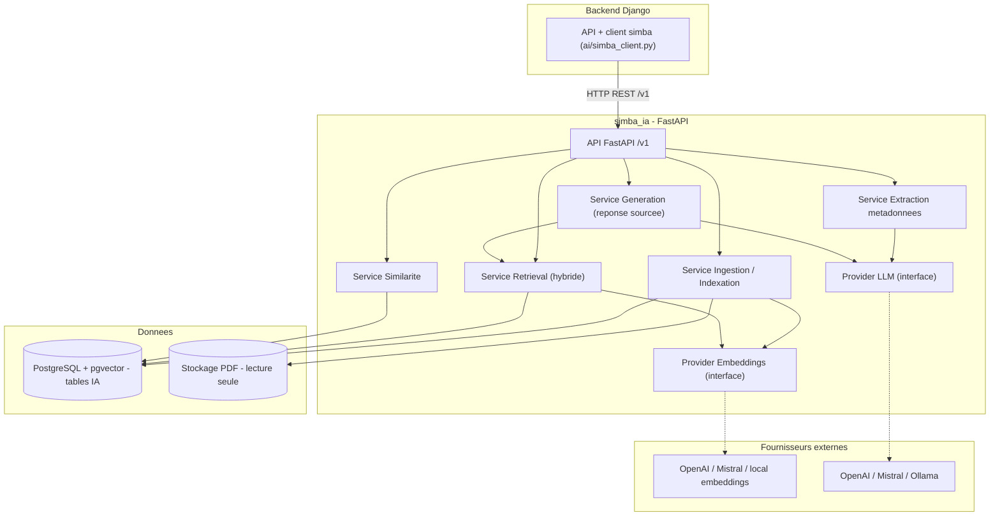
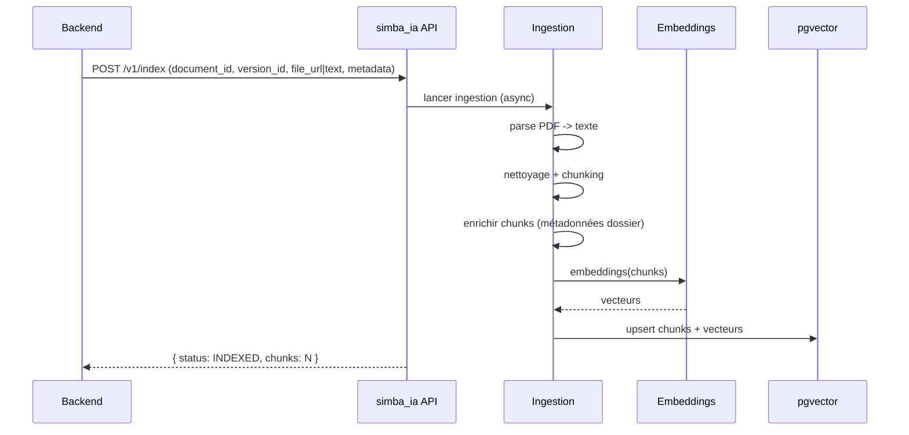
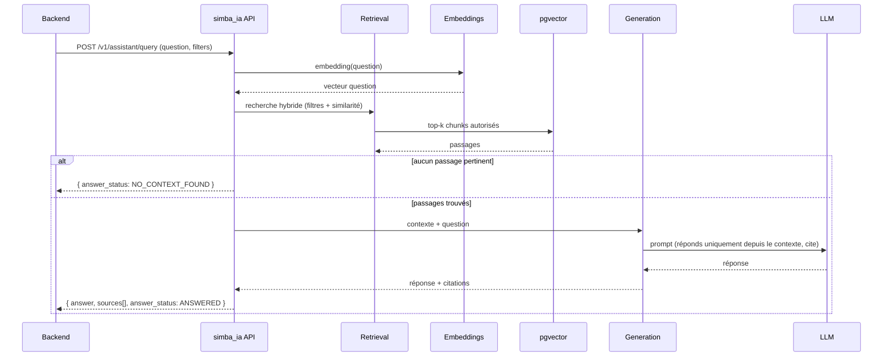

# simba_ia — Architecture technique

> Architecture du microservice IA (FastAPI). Voir [RAG_PIPELINE.md](RAG_PIPELINE.md), [DATA_MODEL.md](DATA_MODEL.md), [API_SPEC.md](API_SPEC.md), [INTEGRATION.md](INTEGRATION.md).

---

## 1. Place dans le monorepo

```text
OpenScienceHub/
├── backend/      # Django + DRF — appelant principal de simba_ia
├── simba_ia/     # CE SERVICE — FastAPI : extraction + Assistant IA (RAG)  <—
├── ids/          # e-IDStack de IDS (SSI) — sans rapport avec simba_ia
└── frontend/     # App web (n'appelle pas simba_ia directement)
```

`simba_ia` est **uniquement appelé par le backend** (service interne). Les utilisateurs finaux ne l'atteignent jamais directement : auth, droits et visibilités sont gérés par le backend, qui transmet à `simba_ia` les **filtres** autorisés.

## 2. Diagramme de composants



## 3. Structure du code

```text
simba_ia/
├── pyproject.toml / requirements.txt
├── app/
│   ├── main.py               # app FastAPI, montage des routers, /health
│   ├── core/
│   │   ├── config.py         # pydantic-settings (env)
│   │   ├── logging.py        # logs structurés
│   │   └── security.py       # auth service-to-service (clé interne)
│   ├── api/v1/
│   │   ├── extract.py        # POST /v1/extract
│   │   ├── index.py          # POST /v1/index
│   │   ├── assistant.py      # POST /v1/assistant/query
│   │   ├── similar.py        # POST /v1/similar
│   │   └── summarize.py      # POST /v1/summarize
│   ├── schemas/              # modèles Pydantic (requêtes/réponses)
│   ├── services/
│   │   ├── extraction.py     # extraction métadonnées
│   │   ├── ingestion.py      # parse PDF -> clean -> chunk -> embed -> store
│   │   ├── retrieval.py      # recherche hybride (filtres + sémantique)
│   │   ├── generation.py     # assemblage contexte + génération sourcée
│   │   └── similarity.py     # travaux similaires
│   ├── providers/
│   │   ├── base.py           # interfaces EmbeddingProvider / LLMProvider
│   │   ├── openai_provider.py
│   │   ├── local_provider.py
│   │   └── mock_provider.py  # mode démo hors-ligne
│   └── db/
│       ├── session.py        # connexion PostgreSQL
│       ├── models.py         # tables IA (chunks, logs)
│       └── repositories.py   # accès pgvector
└── tests/
```

## 4. Flux d'ingestion (au dépôt d'un PDF)



## 5. Flux Assistant IA (question sourcée)



## 6. Abstractions providers

- `EmbeddingProvider.embed(texts) -> vectors` et `LLMProvider.generate(prompt, **opts) -> text`.
- Sélection via config (`EMBEDDING_PROVIDER`, `LLM_PROVIDER`).
- **`mock`** : embeddings déterministes (ex. hashing) + LLM gabarit (réponse construite à partir des passages), pour démo sans clé externe. Même interface que le réel.
- Choix des modèles/fournisseurs **gratuits** (BGE-M3, Groq, Gemini, Ollama, GROBID, etc.), comparatif et licences : voir [FREE_STACK_OPTIONS.md](FREE_STACK_OPTIONS.md). Défaut recommandé : **embeddings BGE-M3 (local)** + **LLM Groq/Gemini (free)** ou **Ollama (hors-ligne)**.

## 7. Données et stockage

- **PostgreSQL + pgvector** : tables IA dédiées (`ai_chunk`, `ai_query_log`, ...). Voir [DATA_MODEL.md](DATA_MODEL.md). Peut partager l'instance Postgres du backend (schéma séparé) ou une base dédiée.
- **Stockage PDF** : `simba_ia` lit le PDF via `file_url` fourni par le backend (ou reçoit le texte déjà extrait). Accès **lecture seule**.
- `simba_ia` **n'est pas** propriétaire des dossiers/statuts : il stocke uniquement chunks, vecteurs et logs IA.

## 8. Sécurité et configuration

- **Auth service-to-service** : clé interne (`SIMBA_API_KEY`) exigée sur tous les endpoints (sauf `/health`).
- **Secrets** via env : `DATABASE_URL`, `OPENAI_API_KEY`/`MISTRAL_API_KEY`, `SIMBA_API_KEY`, `EMBEDDING_PROVIDER`, `LLM_PROVIDER`, `SIMBA_MODE`.
- Pas d'exposition publique directe ; CORS restreint au backend.
- Respect des **filtres de visibilité** transmis par le backend à chaque requête (jamais de document privé en réponse publique).

## 9. Exécution

- **Dev** : `uvicorn app.main:app --reload --port 8001`, PostgreSQL+pgvector via `docker-compose` (partagé avec le backend).
- **Docs API** : OpenAPI automatique FastAPI (`/docs`, `/openapi.json`).
- **Mode** : `SIMBA_MODE=mock|live`.

## 10. Principes

1. **Service d'assistance**, jamais de décision.
2. **Réponses sourcées** ou refus ; pas d'hallucination.
3. **Respect des droits** transmis par le backend.
4. **Providers interchangeables** + `mock` toujours disponible.
5. **Stateless métier** : la vérité (dossiers, droits, statuts) reste au backend.
